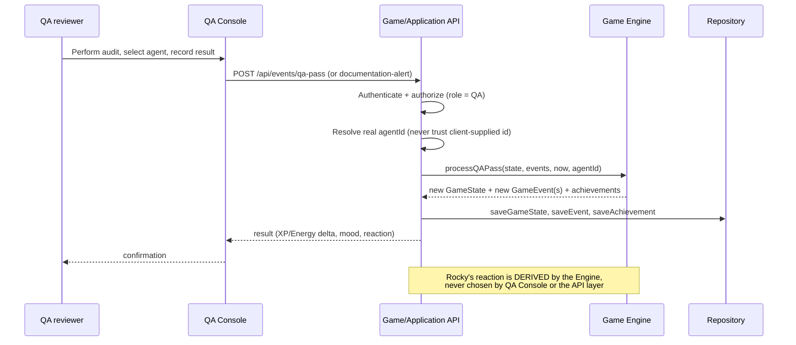
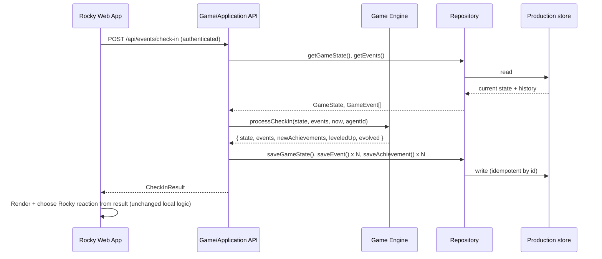
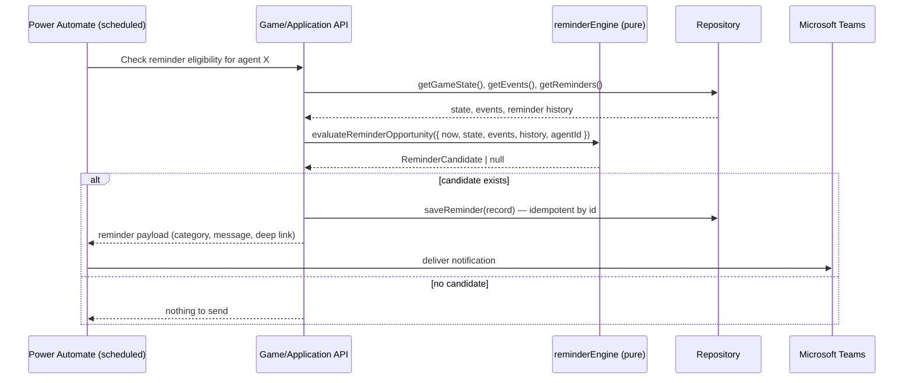

# API & Repository Contracts — Rocky (Design Only)

Phase 11 deliverable. Defines the production `Repository` contract split
and a future API surface as **design contracts**, not implementations. No
endpoint, SharePoint list, or API project is created by this document.

## 1. Repository contracts

The local MVP's single `Repository` interface (`src/repository/repository.ts`)
already draws the correct boundary: the Game Engine and Services talk only
to it, never to `localStorage` (`ARCHITECTURE.md` §Repository). It does not
need to be split for the local implementation to keep working — `README.md`'s
rule "if the existing architecture already provides a better abstraction,
use it" applies literally here, so **no code change is made in this phase**.
What follows documents how that one interface maps onto per-collection
responsibilities, which a production implementation is free to honor as one
class or several.

```ts
// Design-time grouping of the existing Repository interface's methods —
// NOT a proposed code change. src/repository/repository.ts is unchanged.

interface AgentRepository {
  getAgent(): Agent
  saveAgent(agent: Agent): void
}

interface GameStateRepository {
  getGameState(): GameState
  saveGameState(state: GameState): void // optimistic-concurrency write in production (§Storage strategy)
}

interface EventRepository {
  getEvents(): GameEvent[]
  saveEvent(event: GameEvent): void // idempotent by id — unchanged contract
}

interface AchievementRepository {
  getAchievements(): Achievement[]
  saveAchievement(achievement: Achievement): void // idempotent by id
}

interface ReminderRepository {
  getReminders(): ReminderRecord[]
  saveReminder(reminder: ReminderRecord): void // idempotent by id
  updateReminderStatus(id: string, status: ReminderStatus): void
}

interface TeamRepository {
  getTeams(): Team[]
  getTeam(id: string): Team | undefined
}
```

Every method's contract (idempotency, never-throws-on-read behavior,
sanitization) carries over unchanged from `DATA_MODEL.md` §Repository
boundaries and `ARCHITECTURE.md` §Repository — a production
`SharePointRepository`/`ApiRepository` must honor the same guarantees
`LocalStorageRepository` already does, not weaker ones.

`resetReminders()`/`resetAll()` are local-MVP-only operations (used by
Reset Demo / Reset All Data) and are **not** part of the production
contract — a production Repository has no equivalent "wipe everything"
operation exposed to any role; see §5 (roles), where even ADMIN doesn't get
this.

## 2. Future API surface (design contracts only)

No endpoint below is implemented. Each entry states the same five
responsibilities so a future implementer doesn't have to guess who does
what.

### Agent

**`GET /api/agent/me`**
- Request responsibility: none beyond a valid auth token.
- Response responsibility: return the caller's own `Agent` — never
  another agent's, regardless of what's requested.
- Authorization: any authenticated AGENT/QA/SUPERVISOR/ADMIN; identity
  resolves `agentId` from the token, never from a request parameter.
- Idempotency: read-only, trivially idempotent.
- Validation: none (no body).
- Domain-engine responsibility: none — this is pure Repository passthrough.

### Game state

**`GET /api/game-state`**
- Response: the caller's current `GameState`.
- Authorization: AGENT sees only their own; SUPERVISOR sees a team
  member's only through a permitted team-level view, not this raw
  endpoint.
- Idempotency: read-only.
- Domain-engine responsibility: none directly, but the API should prefer
  serving a value the Engine considers current — see §3 on
  `recalculateStateFromEvents` as the source of truth if `GameState` and
  event history could ever disagree.

**`POST /api/events/check-in`**
- Request: no body beyond auth (server supplies `now`, never trusts a
  client-supplied timestamp — see `SECURITY_BASELINE.md`).
- Response: the same shape `CheckInResult` already has locally (new
  `GameState`, `events`, `newAchievements`, `leveledUp`, `evolved`,
  `alreadyCheckedInToday`).
- Authorization: AGENT, acting only as themselves.
- Idempotency: **required** — a duplicate submission the same calendar
  day must be a no-op (`alreadyCheckedInToday`), exactly like
  `processCheckIn` already guarantees locally. No new idempotency
  mechanism needs inventing; the existing same-day guard is the contract.
- Validation: none beyond identity — there is no numeric input to
  validate for a Check-in.
- Domain-engine responsibility: 100% — the endpoint calls `processCheckIn`
  unchanged and does nothing else with the result but persist and return it.

**`POST /api/events/qa-pass`**
- Request: the agent being audited (resolved via a real identity mapping,
  not a client-supplied `agentId` — see §3), plus whatever audit metadata
  QA Console captures (audit date, reference).
- Response: `QAPassResult` shape (unchanged from local).
- Authorization: **QA role only** — never AGENT (an agent cannot self-report
  a QA Pass).
- Idempotency: the underlying event needs a stable id (e.g. derived from
  the audit system's own record id) so a retried submission doesn't double-grant.
- Validation: the audited `agentId` must resolve to a real agent; the
  audit date must be a valid date not in the future.
- Domain-engine responsibility: 100% — calls `processQAPass` unchanged.

**`POST /api/events/documentation-alert`**
- Same shape as QA Pass, `QA` role only, calls `processDocumentationAlert`
  unchanged.

**`POST /api/events/correction`**
- Request: `CorrectionInput` shape (references the original event id,
  states the corrected `QAOutcome`).
- Authorization: QA role, and only within whatever correction-authorization
  policy RLX confirms (§24 Q9) — e.g. only the submitting QA reviewer, or
  a supervisor override.
- Idempotency: the correction event itself is a new immutable event with
  its own id — resubmitting the identical correction is idempotent by
  that id, same as any other event.
- Domain-engine responsibility: 100% — calls `processCorrection`
  unchanged, which triggers `recalculateStateFromEvents` under the hood.

### Achievements

**`GET /api/achievements`** — read-only, own-agent-only, no Engine
computation beyond what `getAchievementProgress()` already does locally
(unlocked list + metrics for progress bars).

### Leaderboard

**`GET /api/leaderboard`** — read-only. Response responsibility: the same
ranked shape `rankLeaderboardEntries` already produces. In production this
would rank real agents instead of `MOCK_AGENTS` — the ranking algorithm
(`engine/leaderboard.ts`) does not change; only the Repository's data
source does. No QA-failure or punitive data is ever included (unchanged
product rule, `DOMAIN_RULES.md`).

### Team

**`GET /api/team`** — the caller's own team detail (`TeamDetail` shape).

**`GET /api/team-leaderboard`** — all teams, ranked (`TeamRankEntry[]`
shape, via `rankTeams`/`calculateTeamScore` unchanged).

Authorization for both: AGENT sees their own team; SUPERVISOR sees
permitted teams; neither can see another team's raw member-level detail
beyond what the product already exposes today (name, level, streak — no
QA-failure data, unchanged rule).

### Reminders

**`GET /api/reminders`** — the caller's own reminder history.

**`POST /api/reminders/{id}/opened`**
**`POST /api/reminders/{id}/acted`**
**`POST /api/reminders/{id}/dismissed`**
- Authorization: the reminder's own agent only.
- Idempotency: transitioning an already-transitioned reminder to the same
  status is a no-op; `updateReminderStatus` already treats this as a
  plain write, so the API layer should treat a repeat call as
  harmless, not an error.
- Domain-engine responsibility: none — reminder status is UI/lifecycle
  bookkeeping, never an input to XP/Energy/Streak/Mood (unchanged rule,
  `DOMAIN_RULES.md` §Reminders).
- Note: **acting** on an actionable reminder (e.g. "Check In With Rocky")
  calls `POST /api/events/check-in` — the same endpoint Home's button
  calls — never a reminder-specific check-in path. This preserves the
  local rule "a reminder never grants XP by itself."

## 3. QA integration boundary

This is the most important boundary in the whole design (per the Fase 11
brief) — repeated here in full because it must never erode:



**QA Console (and the API layer behind it) is an event producer, never a
state mutator.** The only three requests it can make against the system
are "record a QA Pass," "record a Documentation Alert," and "record a
Correction" — each becomes exactly one domain event, processed by the
unchanged Engine functions that already exist locally
(`processQAPass`/`processDocumentationAlert`/`processCorrection`).

Explicitly forbidden, with no exception path:
- QA directly sets Energy.
- QA directly sets Current Streak.
- QA directly sets XP.
- QA directly sets Mood.
- QA directly sets Evolution stage or unlocks an Achievement.

If a future requirement seems to need one of these, the correct answer is
a new **event type** processed by the Engine (so the consequence is still
derived and auditable), never a direct write path. This is ADR-0002.

## 4. Event flow (unchanged from local, now spanning the network)



This is exactly the five-step flow `ARCHITECTURE.md` §Event flow already
documents for the local MVP, with "UI calls a Service method" replaced by
"UI calls an API endpoint that does what the Service method already did."
`recalculateStateFromEvents` remains the tie-breaker if `GameState` and the
event history ever disagree — production doesn't change that rule, it just
means the API (not a Service running in the browser) is what invokes it.

## 5. Reminder flow (unchanged rules, new transport)



Working hours, cooldown, adaptive cooldown, daily cap, and category
priority are unchanged — they live in `reminderEngine.ts`/`GAME_CONFIG`
today and stay there; Power Automate never re-implements or second-guesses
any of it (§6 of `PRODUCTION_ARCHITECTURE.md`).
