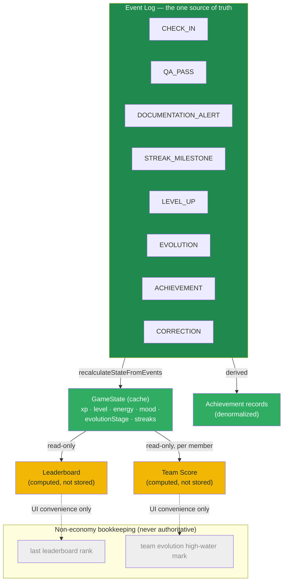

# Data Ownership — Rocky (Design Only)

Phase 11 deliverable. For every collection and field that matters, this
document states the source of truth, who can write it, who can read it,
whether it's derived, whether it's persisted, and whether it's
reconstructed from events. Shapes referenced are the existing ones in
`DATA_MODEL.md` — nothing here changes them.

## 1. Classification used throughout

- **PERMANENT** — never decreases; only a `CORRECTION` event can alter its
  trajectory, and even then by reprocessing history, never by direct edit.
- **DYNAMIC** — can go up or down as a normal consequence of events.
- **EVENT-DERIVED** — not stored as an independent fact at all; it is
  whatever `recalculateStateFromEvents` (or an equivalent read model)
  computes from the event log at the moment it's needed. `GameState` is a
  *cache* of this, never a competing source of truth.

| Field | Class | Notes |
|---|---|---|
| XP | PERMANENT | Only moves via a `CORRECTION`'s replay effect |
| Level | PERMANENT | Derived from XP against `LEVEL_THRESHOLDS`; never decreases |
| Historical achievements | PERMANENT | Unlock once, never removed (`DOMAIN_RULES.md` §Achievements) |
| Best Streak | PERMANENT | `max(bestStreak, currentStreak)`, never reduced |
| Evolution high-water mark | PERMANENT | Monotonic — `evaluateEvolution` never returns a lower stage than current |
| Energy | DYNAMIC | 0-100, moves with Check-in/QA Pass/Alert |
| Mood | DYNAMIC / EVENT-DERIVED | Never cached as independent fact — always computed live from `GameState` (`calculateMood`) |
| Current Streak | DYNAMIC | Resets on a gap or an Alert |
| Consequences of Check-in / QA Pass / Alert / corrections / milestones / level-up / evolution | EVENT-DERIVED | Each is a `GameEvent`; `GameState` is the cache of their cumulative effect |

## 2. Ownership matrix

| Entity / field | Source of truth | Who writes | Who reads | Derived? | Persisted? | Reconstructed from events? |
|---|---|---|---|---|---|---|
| **Agent** (`id`, `name`, `rockyName`) | Repository (Agent record) | Onboarding flow (self); ADMIN for corrective identity fixes only | Self; QA/SUPERVISOR (name only, for team/audit context) | No | Yes | No — identity is not event-sourced |
| **GameState.xp** | Event log | Never written directly — only via `saveGameState` after an Engine function computes it | Self; SUPERVISOR (team aggregate only, never raw) | Yes | Yes (cache) | Yes |
| **GameState.level** | Event log (derived from xp) | Same as xp | Self; SUPERVISOR (aggregate) | Yes | Yes (cache) | Yes |
| **GameState.energy** | Event log | Same as xp | Self only | Yes | Yes (cache) | Yes |
| **GameState.mood** | Live computation (`calculateMood`) | Never written as an independent fact | Self; SUPERVISOR (aggregate) | Yes | Cached in `GameState` for convenience, but must never be trusted over a fresh `calculateMood()` call | Yes (indirectly, via the state it reads) |
| **GameState.evolutionStage** | Event log | Same as xp | Self; QA (context); SUPERVISOR/team views | Yes | Yes (cache) | Yes |
| **GameState.currentStreak / bestStreak** | Event log | Same as xp | Self; SUPERVISOR (aggregate) | Yes | Yes (cache) | Yes |
| **GameEvent** (all types) | Itself — the event log **is** the source of truth | API layer only, on behalf of an authenticated AGENT (Check-in) or QA (QA Pass/Alert/Correction) action | Nobody reads raw events directly in the UI today; a future audit/reporting surface might, under ADMIN/QA authorization | No — this is the primitive | Yes, immutably | N/A — this *is* what gets replayed |
| **Achievement** | Event log (`ACHIEVEMENT` events) + denormalized record | API layer, derived from Engine evaluation only | Self | Yes (denormalized for cheap reads) | Yes | Yes — event log remains authoritative if the denormalized record and the log ever disagree |
| **ReminderRecord** | Repository | API layer (`reminderEngine` decision) for creation; the reminder's own agent for status transitions (opened/dismissed/acted) | Self only | Partially (content is computed; status is direct user action) | Yes | No — reminders are their own record, not replayed into `GameState` |
| **Team** | Repository (near-static roster) | ADMIN (team assignment) | AGENT (own team), SUPERVISOR (permitted teams) | No | Yes | No |
| **TeamScore** | Live computation (`calculateTeamScore`) from member `GameState`/event data | Never written directly | AGENT (own team), SUPERVISOR | Yes — always recomputed, never a stored economy value | Only small non-economy bookkeeping is persisted (high-water mark, last score — see below) | Indirectly, via each member's event-derived state |
| **EvolutionStage (Team)** | Live computation (`evaluateTeamEvolution`), monotonic like individual Evolution | Never written directly (only the high-water-mark cache is) | AGENT, SUPERVISOR | Yes | High-water mark cached (see below) | Indirectly |

## 3. Non-economy bookkeeping (explicitly NOT a second source of truth)

The local MVP persists a few small UI-facing signals outside the
`Repository` interface, directly in dedicated storage keys
(`DATA_MODEL.md` §Team/Leaderboard-related data):

- Last-seen individual leaderboard rank (`rocky.leaderboard.lastRank`)
- Team Evolution high-water mark (`rocky.teams.highestStage`)
- Team's last score / last rank (`rocky.teams.lastScore`, `rocky.teams.lastRank`)

These exist purely so Rocky can react to "you moved up" or show a Recovery
mood after a dip. **They must never be read as authoritative XP/Energy/
Streak/Evolution data**, in local or production form — they are display
memory, not economy. In production this bookkeeping can live in the same
Repository/store as everything else, but it must stay tagged as
non-authoritative in whatever schema documentation the production store
ends up with, so a future report-writer doesn't accidentally treat "last
seen rank" as a ranking fact.

## 4. Data ownership diagram

## 5. Production implication

None of this changes in production. The API layer becomes the only writer
of `GameState`/events/achievements (replacing the browser-side
`GameService`), and the production `Repository` implementation becomes the
only thing touching the real store — but the *ownership rules* above are
unchanged, because they were never local-storage-specific to begin with.
