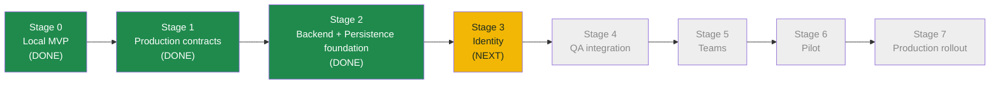

# Migration Plan — Local MVP → Production (Design Only)

Phase 11 deliverable. A staged plan for migrating the current local MVP
(Phases 1-10, DEMO READY) toward production, without redesigning the
product or the Game Engine. **No stage beyond Stage 0 is implemented by
this phase** — this document defines the path, it doesn't walk it.

## Roadmap

## Stage 0 — Current Local MVP *(done)*

- `localStorage`, mock agents, fictitious teammates, local Game Engine.
- 262/262 tests, clean type-check, successful build.
- **What remains unchanged going forward**: everything in `src/engine/`,
  the domain types, the game rules in `DOMAIN_RULES.md`.

## Stage 1 — Production contracts *(done — Phase 11)*

- Repository contracts documented (`API_CONTRACTS.md` §1).
- API contracts documented (`API_CONTRACTS.md` §2).
- Identity mapping design (`PRODUCTION_ARCHITECTURE.md` §4 — roles; §5
  Teams identity mapping).
- QA boundary documented (`API_CONTRACTS.md` §3).
- **Prerequisites**: none — this is a documentation stage.
- **Risks**: contracts drift from what Stage 2 actually needs if written
  too speculatively; mitigated by grounding every contract in a method
  that already exists in the local Service layer (done throughout this
  document set).
- **Dependencies**: none.
- **Rollback**: trivial — these are docs, not running systems.
- **What remains unchanged**: the entire local MVP; this stage adds
  documentation alongside it.

## Stage 2 — Backend foundation *(completed — Phase 12 + 13)*

> **Numbering note (Phase 13):** the Phase 13 brief asked for a
> "Stage 3 — Production Persistence Foundation" to be marked complete
> separately. This plan's Stage 3 was already named **Identity** back in
> Phase 11 (Entra ID) and is still in that unstarted state (below) — so
> renumbering would either collide with it or silently shift every later
> stage's number out from under previously-written cross-references.
> Instead, the persistence work is recorded here, as a second completed
> milestone within Stage 2 ("Backend foundation"), which is where it
> actually belongs conceptually — a durable Repository implementation is
> part of standing up the backend, not a separate stage of the roadmap.

**Done (Phase 12):** the Game/Application API (§B of
`PRODUCTION_ARCHITECTURE.md`) is implemented at `backend/`, reusing the
Game Engine's existing functions unchanged (`processCheckIn`,
`processQAPass`, `processDocumentationAlert`, `processCorrection`,
`recalculateStateFromEvents`, `evaluateReminderOpportunity` — via the
unmodified `GameService`/`reminderService`/`teamService`/
`leaderboardService`). All endpoints from `docs/API_CONTRACTS.md` §2 are
live. A development-only `X-Dev-Agent-Id`/`X-Dev-Role` identity mechanism
stands in for real authentication, hard-disabled whenever
`NODE_ENV=production`.

**Done (Phase 13):** a **durable local** `Repository` implementation —
`SqliteRepositoryStore` (`node:sqlite`), surviving a process restart —
exists alongside the Phase 12 in-memory one, selected by configuration
(`ROCKY_PERSISTENCE_DRIVER`). Check-in/QA Pass/Alert/Correction each run
inside a real SQL transaction. HTTP idempotency (`Idempotency-Key`) is now
durable too, with same-key-different-payload detection. A production
fail-fast guard refuses to start with anything other than the durable
driver. Full detail: `docs/PERSISTENCE_FOUNDATION.md`. **78/78 backend
tests pass** (40 Phase 12 + 38 Phase 13); the frontend's 262/262 remain
unaffected (still runs on `localStorage` — the backend is not wired to
it).

**Still open (not done in Phase 12 or 13):**
- Implement a **production** `Repository` (SharePoint- or database-backed,
  per whatever RLX/IT approves — §Storage strategy) — the local SQLite
  file is a single-process development/pilot durability foundation, not a
  production data store (no replication, no multi-instance concurrency
  story, no backup/retention policy — see `docs/PERSISTENCE_FOUNDATION.md`
  §11).
- Deploy the backend anywhere (Azure App Service/Functions or otherwise)
  — it currently only runs on a developer's own machine.
- **Prerequisites for the remaining work**: an approved hosting
  environment and data store from RLX/IT.
- **Risks**: choosing a store that doesn't scale to real event volume
  (see `PRODUCTION_ARCHITECTURE.md` §Storage strategy scalability
  discussion); a real production deployment needing more than one backend
  instance will need its own concurrency design (Phase 13's guarantees are
  explicitly scoped to a single Node process).
- **Dependencies**: Azure/hosting approval, data store approval — both
  RLX/IT decisions (§Migration blockers).
- **Rollback**: the local MVP keeps working independently throughout —
  nothing about standing up a backend or its persistence requires
  touching or disabling it; the backend itself is not deployed anywhere
  yet, so there's nothing in production to roll back.
- **What remains unchanged**: the Game Engine's business rules, the
  domain types, `GAME_CONFIG` values — confirmed by both phases'
  grep-based architecture quality checks finding zero business-rule
  duplication in `backend/src/`.

## Stage 3 — Identity

- Introduce Microsoft Entra ID authentication in front of the API and
  Rocky Web App.
- Map authenticated identity → `agentId`, and → role (AGENT/QA/
  SUPERVISOR/ADMIN).
- **Prerequisites**: Stage 2 API exists to authenticate in front of; an
  Entra ID app registration approved by RLX/IT.
- **Risks**: coupling identity logic into the Game Engine by mistake —
  explicitly guarded against (§23 Q6 below); incomplete role mapping
  causing over- or under-privileged access.
- **Dependencies**: Entra ID tenant/app registration approval (RLX/IT).
- **Rollback**: identity sits in front of the API as middleware — it can
  be disabled/rolled back without touching the API's business logic or
  the Engine.
- **What remains unchanged**: the Engine never receives or interprets an
  identity token — it only ever receives an `agentId` string, exactly as
  it does locally today.

## Stage 4 — QA integration

- Build the QA Console (§E of `PRODUCTION_ARCHITECTURE.md`).
- Wire it to the QA event-producer endpoints only (`/api/events/qa-pass`,
  `/api/events/documentation-alert`, `/api/events/correction`).
- Establish the real audit workflow (agent selection, audit date capture,
  correction authorization policy — §24 Q9).
- **Prerequisites**: Stage 2 (API), Stage 3 (QA role must exist and be
  authenticated).
- **Risks**: QA Console scope creep into directly editing gamification
  state — explicitly forbidden (`API_CONTRACTS.md` §3); correction
  authorization policy left undefined causing either too much or too
  little QA power.
- **Dependencies**: a decided correction-authorization policy (RLX
  business decision, not an engineering one).
- **Rollback**: QA Console is a separate surface from the Rocky Web App —
  it can be paused without affecting agents' experience, though QA audits
  would need another interim recording mechanism during any rollback.
- **What remains unchanged**: `processQAPass`/`processDocumentationAlert`/
  `processCorrection` — QA Console is a new *front door* to functions that
  already exist and are already tested.

## Stage 5 — Teams

- Teams entry point (deep link / tab / personal app) into the Rocky Web
  App.
- Power Automate orchestration for scheduled reminder delivery to Teams.
- **Prerequisites**: Stage 2 (API), Stage 3 (identity — Teams SSO needs
  Entra ID wired up).
- **Risks**: putting reminder-eligibility logic into Power Automate
  instead of calling the API's answer (explicitly forbidden,
  `PRODUCTION_ARCHITECTURE.md` §6); notification fatigue if working-hours/
  cooldown rules aren't respected end-to-end through the new transport.
- **Dependencies**: Teams app registration/approval, Power Automate
  licensing/connector approval (RLX/IT).
- **Rollback**: Teams is an additional entry point, not a replacement for
  direct web access — it can be disabled while the Rocky Web App keeps
  working via direct URL.
- **What remains unchanged**: `reminderEngine.ts`'s eligibility rules;
  Power Automate only ever calls the API and delivers what it's told to
  deliver.

## Stage 6 — Pilot

- Limited agents/one team, real (opted-in) data, active monitoring,
  structured feedback collection.
- **Prerequisites**: Stages 2-5 complete and individually validated;
  security review passed (`SECURITY_BASELINE.md`); privacy/data
  governance review passed.
- **Risks**: real data surfacing product edge cases the mock roster never
  exercised (e.g. genuinely large event histories, real team-size
  imbalances); pilot participants' expectations vs. what's actually
  implemented.
- **Dependencies**: UAT sign-off, a defined pilot cohort, a support/
  escalation path for pilot issues.
- **Rollback**: pilot is inherently limited-blast-radius — a full halt
  reverts pilot participants to whatever their prior documentation
  process was, without needing to unwind any non-pilot production
  system.
- **What remains unchanged**: nothing about the pilot changes game rules
  or artwork — it validates the production wiring around an unchanged
  product.

## Stage 7 — Production rollout

- Controlled expansion beyond the pilot cohort, with defined operational
  ownership (who's on call, who owns the data store, who approves future
  rule changes).
- **Prerequisites**: successful pilot, operational ownership assigned,
  monitoring/alerting live.
- **Risks**: scaling issues not visible at pilot size (see storage
  scalability discussion); insufficient operational ownership leading to
  unaddressed incidents.
- **Dependencies**: RLX sign-off on full rollout, ongoing infrastructure
  cost approval.
- **Rollback**: a staged/percentage rollout (if the hosting platform
  supports it) is strongly preferable to an all-at-once cutover, so a
  problem discovered post-pilot doesn't affect every agent at once.
- **What remains unchanged**: the product. Rollout is an operational and
  organizational milestone, not a design one.

## Migration blockers (DEMO READY → PILOT READY → PRODUCTION READY)

None of the following are confirmed facts — each is a dependency that
needs validation before the stage that requires it can proceed:

| Blocker | Blocks which stage | Owner |
|---|---|---|
| Corporate Azure/hosting environment approval | Stage 2 | RLX/IT |
| Identity/authentication (Entra ID app registration) | Stage 3 | RLX/IT |
| Production repository/data store decision (SharePoint vs. DB) | Stage 2 | RLX/IT |
| API/backend hosting decision | Stage 2 | RLX/IT |
| Real agent identity mapping (Entra ↔ `agentId`) | Stage 3 | RLX/IT |
| QA integration workflow + correction-authorization policy | Stage 4 | RLX business owner |
| Teams app registration/approval | Stage 5 | RLX/IT |
| Power Automate licensing/connector approval | Stage 5 | RLX/IT |
| Security review | Stage 6 | RLX security/IT |
| Privacy/data governance review | Stage 6 | RLX privacy/legal |
| Monitoring/observability stack decision | Stage 6 | RLX/IT |
| Operational ownership assignment | Stage 7 | RLX leadership |
| UAT | Stage 6 | RLX business owner |
| Deployment pipeline | Stage 2 (built), Stage 7 (hardened) | Engineering + RLX/IT |

**None of these are claimed as approved in this document.** They are
listed so a reader knows exactly what to go confirm before assuming any
given stage can start.
