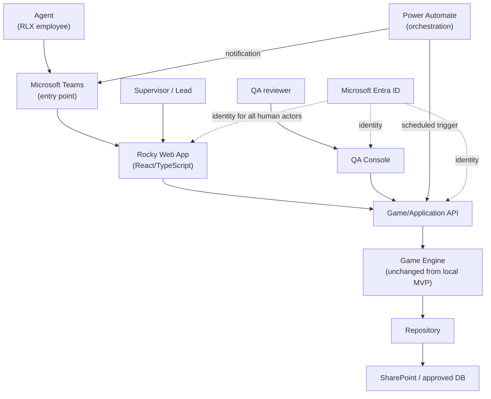
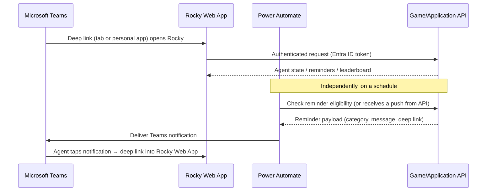

# Production Architecture — Rocky

Phase 11 deliverable. This document designs the target production
architecture for Rocky without implementing any of it — no Azure, no
SharePoint, no Teams SDK, no Power Automate, no Microsoft Graph, no
authentication. It exists so a future implementation phase can migrate the
already-working local MVP (`ARCHITECTURE.md`, `DOMAIN_RULES.md`,
`DATA_MODEL.md`) without redesigning the product or the Game Engine.

Everything the local MVP already got right is preserved as-is: the
UI → Services → Game Engine → Repository layering, the Clock abstraction,
the centralized `GAME_CONFIG`, event-sourcing with idempotent replay, and
localStorage hardening. Production architecture is additive around that
core, not a replacement for it.

**Phase 12 update:** the Game/Application API (§2.B below) is no longer
purely a design contract — a first implementation exists at `backend/`,
proving this document's central claim. See `docs/BACKEND_FOUNDATION.md`
for what was actually built (Node.js/TypeScript/Express, an
`InMemoryRepository`, a development-only identity header — no production
integration).

**Phase 13 update:** the Repository Boundary (§2.D) now also has a
**durable local** implementation — SQLite via `node:sqlite`, surviving a
process restart — sitting behind the exact same `Repository` interface,
selected purely by configuration. See `docs/PERSISTENCE_FOUNDATION.md`.
This proves the Repository Boundary's central promise (§2.D, ADR-0003)
without yet building the production adapter:

```
Teams
  ↓
Rocky Web App
  ↓
Game/Application API      (implemented, Phase 12)
  ↓
Game Engine                (unchanged since the local MVP)
  ↓
Repository Boundary        (unchanged interface, Phase 12-13)
  ↓
Durable Persistence Adapter  (SQLite, local-only — implemented, Phase 13)
  ↓
[future SharePoint / approved DB]   ← NOT implemented; see docs/MIGRATION_PLAN.md Stage 2
```

Every "not implemented" statement elsewhere in this document remains
accurate for Azure/SharePoint/Teams/Power Automate/Graph/Entra ID/real
data — SQLite is a **local development durability foundation**, not a
production data store, and is never claimed to be one.

## 1. System context



Nothing here is a business-rule component except the Game Engine box.
Every other box is transport, presentation, orchestration, or storage.

## 2. Production components

### A. Rocky Web App

React/TypeScript frontend — the same one that exists today, extended, not
replaced. Owns:

- the agent experience (Home, Achievements, Leaderboard, Team, Team
  Leaderboard, Onboarding),
- Rocky's visualization (evolution + mood art, reactions — unchanged),
- the reminder UI (toast/host pattern — unchanged),
- calling the Game/Application API instead of a local `Repository`
  directly, once that API exists.

It still contains **no** business rules. Today it calls `gameService`
methods that call the Engine directly; in production it calls API
endpoints that do the same thing server-side. The component code barely
changes — what changes is which `Repository` implementation (or API
client shaped like one) `GameService` is constructed with.

QA Simulator and Developer Controls, as they exist today, are **local/dev
only** and do not ship to production (see §5, role `DEVELOPER`). The QA
Console (below) is their production replacement for QA users — it is a
distinct experience, not QA Simulator promoted to prod.

### B. Game/Application API

**Implemented (Phase 12, `backend/`)** for local/dev/test, using an
`InMemoryRepository` in place of a production data store — see
`docs/BACKEND_FOUNDATION.md`. The endpoints, DTOs, and QA boundary below
match what was actually built; only the data store and identity provider
remain to swap in for a real production deployment (Stages 2-3,
`docs/MIGRATION_PLAN.md`).

This is the production home for what `GameService`/`reminderService`/
`teamService`/`leaderboardService` already do, moved server-side.
Responsibilities (mirrors the existing Service layer's method list — see
`ARCHITECTURE.md` §Services):

| Responsibility | Today (local) | Production |
|---|---|---|
| Retrieve agent state | `gameService.getSnapshot()` | `GET /api/game-state` |
| Process Check-in | `gameService.checkIn()` | `POST /api/events/check-in` |
| Process QA Pass | `gameService.qaPass()` | `POST /api/events/qa-pass` |
| Process Documentation Alert | `gameService.documentationAlert()` | `POST /api/events/documentation-alert` |
| Process a correction | `gameService.correction()` | `POST /api/events/correction` |
| Retrieve achievements | `gameService.getAchievementProgress()` | `GET /api/achievements` |
| Retrieve leaderboard | `leaderboardService.getIndividualLeaderboardWithRankChange()` | `GET /api/leaderboard` |
| Retrieve team state | `teamService.getTeamDetail()` | `GET /api/team` |
| Retrieve reminders | `reminderService.checkForReminder()` / `getReminderHistory()` | `GET /api/reminders` |
| Record an event | (implicit — Services call `repo.saveEvent`) | every `POST /api/events/*` |

The API is a thin adapter: authenticate the caller, resolve which
`agentId` they're allowed to act as, validate the request shape, call the
same Engine functions the local Service layer already calls
(`processCheckIn`, `processQAPass`, `processDocumentationAlert`,
`processCorrection`, `recalculateStateFromEvents`, `evaluateReminderOpportunity`,
etc.), persist through the production `Repository`, and return a result.
It must **not** grow its own parallel copy of any rule.

### C. Domain / Game Engine

**Unchanged.** `src/engine/` remains the single authoritative source for:

XP, Level, Energy, Mood, Streak, Achievements, Evolution, Recovery, event
processing, corrections, and deterministic state reconstruction
(`recalculateStateFromEvents`). It already has zero dependency on React,
`window`, or `localStorage` (`ARCHITECTURE.md` §Game Engine) — that
independence is *why* this migration is possible without a rewrite. See
§23 (Final Architecture Review, Q1) and ADR-0001.

### D. Repository

Production responsibilities are the same shapes the local
`Repository` interface already defines (`DATA_MODEL.md` §Repository
boundaries), against a production store instead of `localStorage`:

- Agent — get/save.
- GameState — get/save (a derived cache — see `DATA_OWNERSHIP.md`).
- Events — get/append (immutable, idempotent by id).
- Achievements — get/append (idempotent by id).
- Reminders — get/append/update-status.
- Teams — get all / get one (read-mostly; see `DATA_OWNERSHIP.md` for why
  Team data is computed, not a parallel economy).
- Settings/configuration — read-mostly, e.g. `WorkingHoursSettings`, where
  a production admin surface makes them editable.

See `API_CONTRACTS.md` §Repository Contracts for the full interface-level
design.

### E. QA Console

A separate production surface (not QA Simulator) for QA reviewers:

- QA signs in with corporate identity (role `QA`, §5).
- Selects/references the agent whose documentation was audited (by real
  agent identity, not a fictitious mock roster).
- Records the audit result — **submits an event**, either "QA Pass" or
  "Documentation Alert" — including the audit date.
- Can submit a **correction** to a previously recorded result, subject to
  authorization (e.g. only their own recent submissions, or a supervisor
  override — a policy decision for §24 Q9, not decided here).
- Every submission and correction is retained as an audit trail (the
  event log already gives this for free — see §9).

**QA Console cannot, under any circumstance, submit a request that sets
XP/Energy/Level/Streak/Mood/Evolution/Achievements directly.** Its only
egress from the QA Console into the system is "create a
`QA_PASS`/`DOCUMENTATION_ALERT`/`CORRECTION` event" — the same shape the
Game Engine already accepts from the local `GameService.qaPass()` /
`.documentationAlert()` / `.correction()` methods today. See §9 for the
full QA integration boundary and ADR-0002.

## 3. The architecture principle

> **The Game Engine must remain independent from Microsoft 365.**

Concretely, none of the following may contain business rules, ever:

- React components (Rocky Web App)
- Teams integration
- SharePoint integration
- Power Automate
- the authentication provider
- notification transport
- the Repository implementation

All of them may **call** the Engine's results forward or **feed** the
Engine an event backward. None of them may **decide** what an event does
to `GameState`. This is already true of the local MVP — production
architecture's job is to not let it stop being true as more layers get
added around it.

## 4. Identity and roles

Corporate identity (Microsoft Entra ID) is the intended future
authentication source for every human-facing surface. **Not implemented
in this phase.** The roles below describe what production authorization
should enforce once identity exists — they are a design target, not a
claim that any of this is wired up.

| Role | Can | Cannot |
|---|---|---|
| **AGENT** | See own Rocky, own progression, permitted leaderboard/team info | See other agents' raw event history; manipulate any gamification value directly |
| **QA** | Perform QA actions (submit Pass/Alert events), submit corrections within their authorization | Manually set XP/Energy/Level/Streak/Mood/Evolution/Achievements |
| **SUPERVISOR / LEAD** | See permitted team-level information, team performance | Directly manipulate gamification state for any agent |
| **ADMIN / SYSTEM ADMIN** | Configuration, operational administration (e.g. working-hours settings, reminder caps) | Casually bypass domain rules — an admin override, if ever needed, must itself go through a `CORRECTION` event, never a silent state edit |
| **DEVELOPER** | Local/dev tooling only (today's QA Simulator + Dev Controls) | Exist in production at all — these two surfaces are dev-mode-gated today (`import.meta.env.DEV` / `rocky.mode.qa`) and stay that way; they never ship |

Every role's authorization decision happens server-side, in the
Game/Application API layer — never trusted from a client-supplied claim
(§13 Security Baseline).

## 5. Teams integration (design only)

Intended experience:



Design points to carry into implementation later:

- **Deep-link strategy**: a notification/tab link should route straight
  to the relevant screen (e.g. Home for a Check-in nudge, Team for a
  Celebration), not just "open the app."
- **User identity mapping**: the Teams user's Entra ID object id maps to
  exactly one `agentId` — this mapping is a Repository/API concern
  (`AgentRepository`), never something the Engine or Teams surface needs
  to know how to resolve itself.
- **Notification payload**: category + message + deep link + a
  dedupe/correlation id — deliberately the same shape `ReminderRecord`
  already has (`types/reminder.ts`), so the local reminder engine's output
  can be handed to a notification transport without reshaping.
- **Frequency controls, deduplication, working hours, cooldown**: all
  already exist and are enforced in `reminderEngine.ts`
  (`evaluateReminderOpportunity`) — the Teams transport must not
  re-implement or bypass any of it. Power Automate's job is delivery, not
  eligibility (§6).
- **User preferences**: a future settings surface (who can turn
  reminders down, or opt into more/fewer) writes to the same
  `WorkingHoursSettings`-shaped config the Engine already reads, not a
  Teams-specific parallel setting.

## 6. Power Automate's role

Power Automate is **orchestration**, never the Game Engine.

**Appropriate responsibilities:**
- Triggering a scheduled check ("is a reminder due for agent X right
  now?") against the API.
- Delivering the resulting notification payload to Teams.
- Simple workflow orchestration between approved enterprise systems.

**Never appropriate — these remain in the Game Engine/API, no exceptions:**
- Calculating XP, Level, Streak, or Energy.
- Calculating Mood.
- Deciding Evolution.
- Implementing or approximating any gamification rule.

If a future implementer is tempted to put "if energy < 40 send a nudge"
logic inside a Power Automate flow, that is a violation of this
principle — that condition already lives in `evaluateReminderOpportunity`
and `calculateMood`; Power Automate should call the API and act on its
answer, not recompute it. See ADR-0004.

## 7. Storage strategy (design only — no implementation)

**Not implemented in this phase.** SharePoint is evaluated here only as a
candidate for MVP/pilot scale; nothing below is a commitment. (Phase 13's
SQLite implementation, `docs/PERSISTENCE_FOUNDATION.md`, is a **local
development durability foundation**, deliberately not proposed here as
the production answer — its schema was designed to translate cleanly to
whichever of the options below RLX/IT approves, not to replace this
decision.)

| Collection | SharePoint-list-shaped? | Notes |
|---|---|---|
| Agents | Yes, small list | One item per agent; low write volume |
| Events | Marginal | Append-only, potentially high volume per agent over time; SharePoint list item-count/list-view-threshold limits (2,000-item list view threshold) become a real constraint at scale — see below |
| GameState | Yes, small list | One item per agent, frequently overwritten (see §Data Ownership: it's a derived cache) |
| Achievements | Yes, small list | Low volume — at most 6 rows per agent (`ACHIEVEMENT_CATALOG`) |
| Reminders | Marginal | Higher volume, mostly write-then-rarely-read; a retention/archival policy matters more here than for other collections |
| Teams | Yes, tiny list | A handful of rows, low write volume |
| Configuration | Yes, tiny list | Effectively static |

Discussion points requiring **RLX/IT confirmation before any
implementation decision**:

- **Item IDs**: SharePoint's own item ID vs. a domain `id` (`GameEvent.id`
  etc.) — the domain id must remain the idempotency key regardless of
  what the store's native id is (Repository's job to bridge this, not the
  Engine's).
- **Partitioning / lookup relationships**: events and reminders would be
  list items with an `agentId` lookup/indexed column; GameState and Agent
  are naturally one-row-per-agent.
- **Indexing**: `agentId` and `timestamp` need to be indexed columns for
  event queries to stay performant as history grows — SharePoint indexed
  columns have their own constraints (a single list supports a limited
  number of indexed columns) that need validation against real data
  shape.
- **Concurrency**: SharePoint list items support optimistic concurrency
  via `__metadata.etag` / `If-Match` headers on update — the Repository
  contract should treat `saveGameState` as an optimistic-concurrency
  write (read version, write only if unchanged) rather than blind
  overwrite, to avoid two concurrent Check-ins racing.
- **Audit history / retention**: SharePoint list versioning could serve
  as a secondary audit trail on top of the event log itself, but the
  event log (§9) is already the authoritative one — versioning would be
  belt-and-suspenders, not a replacement.
- **Scalability / query patterns / data volume / reporting**: if event
  volume per agent grows large (years of daily Check-ins × many agents)
  or reporting requirements grow complex (cross-team analytics,
  historical trend queries), a real database (Azure SQL / Dataverse /
  another RLX-approved store) becomes preferable to a SharePoint list.
  **This crossover point is a capacity-planning question for RLX/IT, not
  something to guess at here.**

The `Repository` interface is exactly what makes this an open, deferred
decision rather than a blocking one: whichever store RLX approves,
implementing it is the only thing that changes (ADR-0003).

## 8. Environments

| Environment | Identity | Data | Notes |
|---|---|---|---|
| **LOCAL** | none (today's local MVP) | `localStorage`, mock agents, fictitious teammates | Developer Controls + QA Simulator visible; exists today, keeps working unmodified |
| **LOCAL BACKEND** *(Phase 12-13)* | `X-Dev-Agent-Id`/`X-Dev-Role` headers — **not authentication** | `InMemoryRepository` (test) or durable local SQLite (dev/default, Phase 13) — never a real employee data source | `backend/` running via `npm run dev` — proves the API boundary and, now, durability; not connected to the frontend |
| **DEV** | test/dev Entra ID tenant or test accounts | Synthetic test data only | Future cloud environment for engineers to integrate against |
| **TEST / UAT** | controlled pilot identities | Controlled pilot data, no real employee PII beyond what pilot participants have consented to | QA validation of the full flow before real rollout |
| **PRODUCTION** | corporate Entra ID | Real agent/QA data, approved data source | Monitoring, controlled deployment, no Developer Controls, no QA Simulator |

**Data that must never cross environments:** any real employee/agent
identity or QA audit result must never be copied into LOCAL or DEV. Local
and dev environments only ever use synthetic/mock data
(`mockAgents.ts`'s pattern, generalized) — this is a hard boundary, not a
convenience.

## 9. Observability (design only)

Minimum future signals:

- Application errors (Rocky Web App)
- API errors (Game/Application API)
- Failed event processing (an event the Engine rejected or threw on)
- Duplicate event submission attempts (should be logged as a normal,
  expected idempotency hit — not an error — since the local architecture
  already treats this as a no-op by design)
- Reminder delivery failures (Power Automate → Teams)
- Authentication failures
- Repository/storage failures
- Latency (API, and per-endpoint)
- Event processing duration

**Never** log full employee PII or QA audit content unnecessarily —
correlate by `agentId`/`eventId`, not by name/email, in operational logs.
Every request should carry a correlation/request id that flows from the
Rocky Web App (or Teams/Power Automate) through the API and into the
Repository call, so a single failure can be traced end-to-end without
reconstructing it from timestamps.

See `SECURITY_BASELINE.md` for how this intersects with audit logging.

## 10. Diagrams index

This document contains: system context (§1), Teams sequence (§5). See
`MIGRATION_PLAN.md` for the migration roadmap diagram, `API_CONTRACTS.md`
for the event-flow and QA-flow diagrams, and `DATA_OWNERSHIP.md` for the
data ownership diagram.
